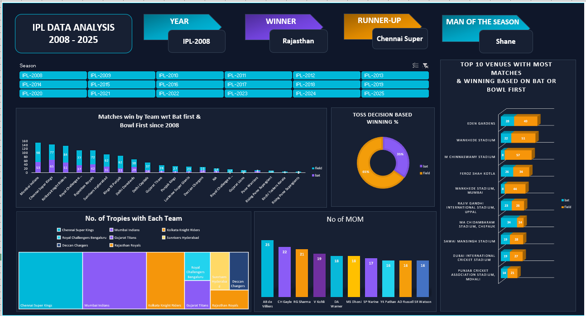

# 🏏 IPL Data Analysis Dashboard | Microsoft Excel

An interactive **IPL Data Analysis Dashboard** developed using **Microsoft Excel** to analyze IPL seasons, team performance, toss decisions, venues, winners, and player performance from **2008 to 2025**.

## 📊 Dashboard Preview


---
## 📌 Project Overview
This project presents an interactive Excel dashboard for analyzing IPL match and team performance across multiple seasons.
The dashboard allows users to explore different IPL seasons and analyze key performance indicators, team statistics, toss decisions, venues, and player performance.
---
## 🎯 Objectives
- Analyze IPL performance across seasons from 2008 to 2025.
- Compare team performance when batting first or bowling first.
- Analyze toss decisions and their relationship with winning percentage.
- Identify venues with the highest number of matches.
- Analyze team-wise trophy counts.
- Identify players with the highest number of Man of the Match awards.
- Create an interactive and visually appealing Excel dashboard.

---
## 📊 Key Dashboard Features
### 🏆 Season Information
The dashboard provides:
- IPL season selection
- Season year
- Winner
- Runner-up
- Man of the Season

### 🏏 Team Performance
Analysis includes:
- Matches won while batting first
- Matches won while bowling first
- Team-wise trophy count
- Team performance comparison

### 🪙 Toss Analysis
The dashboard analyzes:
- Toss decisions
- Bat first vs Field first
- Winning percentage based on toss decision

### 🏟️ Venue Analysis
The dashboard identifies the:
- Top 10 venues with the most matches
- Winning performance based on batting or bowling first

### ⭐ Player Performance
The dashboard includes:
- Top players by number of Man of the Match awards
- Player-wise performance comparison

---
## 🛠️ Tools & Technologies
- Microsoft Excel
- Pivot Tables
- Pivot Charts
- Slicers
- Data Cleaning
- Data Analysis
- Data Visualization
- KPI Reporting
- Excel Dashboard Design

---
## 📈 Key Insights
The dashboard can be used to explore:
- Which IPL teams have won the most trophies.
- How teams perform when batting first compared with bowling first.
- Which venues have hosted the most IPL matches.
- How toss decisions relate to match-winning outcomes.
- Which players have received the most Man of the Match awards.
- How IPL performance has changed across seasons.

---
## 📂 Project Structure
```text
IPL-Data-Analysis-Dashboard/
│
├── README.md
│
├── IPL_Data_Analysis_Dashboard.xlsx
│
└── IPL_Dashboard.png
